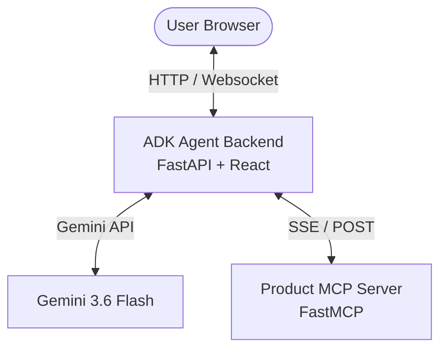
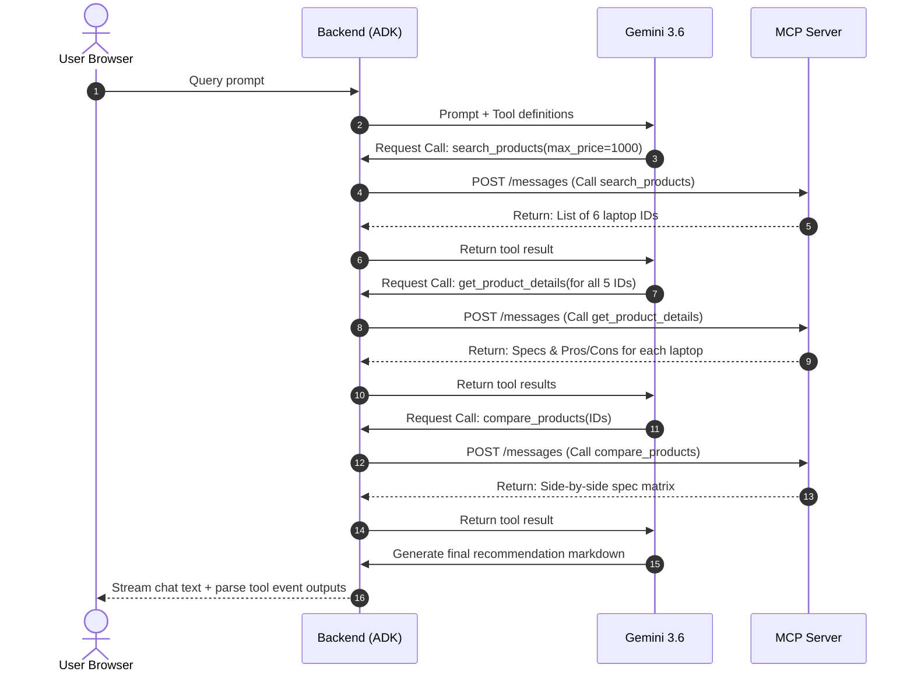

# Product Research Agent: Comprehensive Architecture & Documentation

This repository implements an autonomous **Product Research Agent** powered by the **Google Agent Development Kit (ADK)** and the **Model Context Protocol (MCP)**. 

The application enables users to ask complex product queries (e.g., *"I need a laptop under $1,000 for programming. Find 5 options and recommend the best one."*) and get an immediate, structured analysis alongside a side-by-side spec comparison dashboard.

---

## 🏗️ System Architecture Overview

The system is split into three decoupled components, communicating over standard web protocols:



### Component Details
1. **Frontend (React client):** Built with Vite, Tailwind CSS, and Lucide icons. Serves as a conversational split-screen dashboard: chat and logs on the left, specification table and cards on the right.
2. **Backend (ADK Agent):** Built with FastAPI and Google ADK. Acts as the orchestrator. It receives user prompts, coordinates reasoning with the Gemini model, routes tool requests, and serves the static React assets.
3. **MCP Server (Product Tools):** Built using FastMCP. It manages the product dataset and exposes query-level tools to the agent.

---

## 🛠️ What Was Used, How, and Why

### 1. Google Agent Development Kit (ADK)
* **What:** An SDK for creating agentic workflows using Google Gemini models.
* **How:** Configured an ADK `Agent` running `gemini-3.6-flash`. Equipped the agent with an `McpToolset` mapped to the MCP server's URL.
* **Why:** The ADK simplifies agent orchestration, tool integration, and event stream parsing, translating raw model events into structured function calls and streaming text out-of-the-box.

### 2. Model Context Protocol (MCP) & FastMCP
* **What:** An open standard protocol designed to safely expose local data and tools to LLMs.
* **How:** FastMCP (python SDK) was used to construct the server and define three tools:
  * `search_products(query, max_price)`
  * `get_product_details(product_id)`
  * `compare_products(product_ids)`
* **Why:** Exposing data through an MCP server ensures clear encapsulation of capabilities. It allows the model to selectively call search tools, drill down on specifications, and request comparison grids only when needed.

### 3. Server-Sent Events (SSE) Transport
* **What:** An HTTP-based unidirectional streaming protocol.
* **How:** Enabled via `mcp.run(transport="sse")` on the server and `SseConnectionParams` on the agent.
* **Why:** Unlike standard Stdio-based MCP transport (which is designed for local desktop clients), SSE transport runs over standard HTTP, making it fully compatible with serverless cloud hosting environments like Google Cloud Run.

### 4. Vite + React & Tailwind CSS
* **What:** Modern frontend tooling.
* **How:** Bundled into static HTML/CSS/JS and written directly to the backend's `/static` directory.
* **Why:** Split-screen UI dashboards are easier to build with React state control, and Tailwind allows fast, responsive styling (ideal for side-by-side spec tables).

### 5. Google Cloud Run & Cloud Build
* **What:** Fully managed serverless container runtime and CI/CD compiler.
* **How:** Created separate Dockerfiles for both services. Automated container building and deployment using `gcloud builds submit` and `gcloud run deploy`.
* **Why:** Cloud Run automatically scales containers based on incoming requests, charges only for active CPU use, and handles TLS certificate mapping and traffic routing natively.

---

## 🔄 Step-by-Step Execution Lifecycle

When a user submits: *"I need a laptop under $1,000 for programming..."*, the following sequence takes place:



---

## 📦 File Structure

```text
product_research_agent/
├── deploy.sh              # Bash script for cloud deployment
├── deploy.ps1             # PowerShell script for cloud deployment
├── README.md              # This documentation
│
├── mcp_server/
│   ├── server.py          # FastMCP server + tools + mock database
│   ├── requirements.txt   # MCP server python dependencies (pinned mcp<2.0.0)
│   └── Dockerfile         # Container spec for MCP server
│
├── backend/
│   ├── main.py            # FastAPI server serving ADK agent & frontend
│   ├── Dockerfile         # Container spec for backend & ADK Agent
│   ├── requirements.txt   # Backend dependencies (google-adk, google-genai, etc.)
│   ├── .env               # API keys and MCP URL configuration
│   └── agents/
│       └── product_agent/
│           └── agent.py   # ADK Agent definition + MCP toolset wiring
│
└── frontend/
    ├── package.json       # React dependencies
    ├── tailwind.config.js # Styling configs
    ├── vite.config.js     # Dev and build bundler configuration
    └── src/
        ├── main.jsx       # App mount point
        ├── index.css      # Styling rules
        └── App.jsx        # Conversational split-screen dashboard UI
```

---

## ☁️ Deployed Cloud Services

* **React UI Dashboard:** [https://product-research-backend-450158463415.us-central1.run.app](https://product-research-backend-450158463415.us-central1.run.app)
* **Product MCP Server (SSE Endpoint):** [https://product-mcp-server-450158463415.us-central1.run.app/sse](https://product-mcp-server-450158463415.us-central1.run.app/sse)
